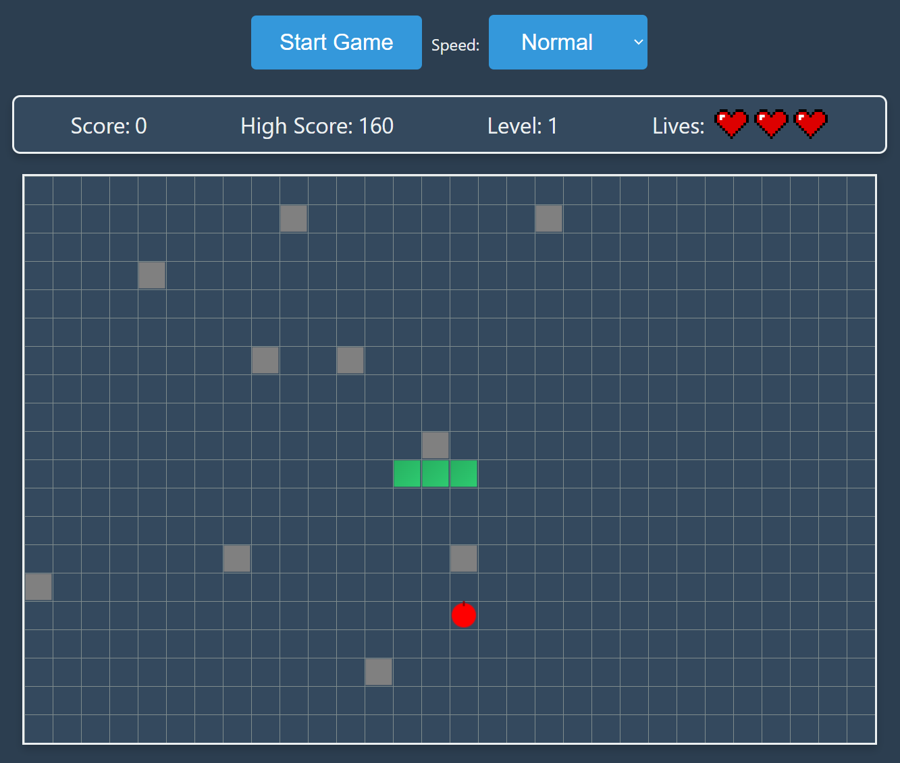

# Snake Game with Enhanced Features



## Table of Contents

- [Introduction](#introduction)
- [Live Demo](#live-demo)
- [Features](#features)
- [Technologies Used](#technologies-used)
- [Installation](#installation)
- [Usage](#usage)
- [Gameplay Instructions](#gameplay-instructions)
- [Project Structure](#project-structure)
- [Contributing](#contributing)


## Introduction

Welcome to the **Snake Game with Enhanced Features**! This is an advanced version of the classic Snake game, built using JavaScript, HTML5 Canvas, and CSS. The game incorporates multiple enhancements to provide a more engaging and challenging experience for players. Whether you're a beginner looking to learn game development or an enthusiast seeking a fun project, this game offers a comprehensive example of implementing game mechanics using the Model-View-Controller (MVC) architecture.

## Live Demo
    
You can play the game live [here](https://zenkhalil.github.io/Snake/).

## Features

- **Grid-Based Movement:** The snake moves strictly within a configurable grid, ensuring precise control and collision detection.
- **Model-View-Controller (MVC) Architecture:** Clean separation of game logic, rendering, and user input handling.
- **Custom Queue Data Structure:** Efficiently manages the snake's segments without relying on built-in JavaScript arrays.
- **Random Food Generation:** Food appears at random, unoccupied positions on the grid.
- **Multiple Food Types:** Different types of food provide unique effects, such as increasing speed, adding segments, or activating abilities.
- **Obstacles:** Static obstacles are placed on the grid to increase difficulty.
- **Levels and Scoring:** Progress through multiple levels, earn scores, and strive to beat your high score.
- **Lives System:** Start with a set number of lives and lose one upon collision with obstacles or the snake's own body.
- **Abilities:** Activate special abilities like passing through obstacles for a limited time.
- **Responsive Controls:** Use arrow keys to navigate the snake and control the game speed through a user interface.
- **Game Over Modal:** A stylish modal appears upon game over, allowing easy restart of the game.
- **Visual Enhancements:** Gradient-filled snake segments and dynamic HUD displaying score, high score, level, lives, and active abilities.

## Technologies Used

- **JavaScript (ES6+)**
- **HTML5 Canvas**
- **CSS3**
- **ES6 Modules**

## Installation

1. **Clone the Repository**

   ```bash
   git clone https://github.com/ZenKhalil/Snake.git
   cd snake-game-enhanced
   ```

2. **Install Dependencies**
    
       This project does not have any external dependencies beyond a modern web browser. Ensure you have the latest version of your preferred browser installed.
    
3. **Run Locally**
    
Open the `index.html` file in your web browser.
    
```bash
       open index.html
```
    
Alternatively, you can use a live server extension or tool for a better development experience.
    
## Usage
    
1. **Start the Game**
    
       - Click the **"Start Game"** button, or any of the arrow keys to begin playing.
    
2. **Control the Snake**
    
       - Use the **Arrow Keys** on your keyboard to navigate the snake:
         - **Up Arrow:** Move Up
         - **Down Arrow:** Move Down
         - **Left Arrow:** Move Left
         - **Right Arrow:** Move Right
    
3. **Adjust Game Speed**
    
       - Use the **Speed Control** dropdown to select your preferred game speed:
         - **X-treme:** Fastest
         - **Fast**
         - **Normal:** Default
         - **Slow:** Easiest
    
4. **Game Over and Restart**
    
       - Upon collision, a **Game Over** modal will appear.
       - Click **"OK"** or the close (`×`) button to restart the game.
    
## Gameplay Instructions
    
 - **Objective:** Navigate the snake to consume food items that appear randomly on the grid. Each food item increases your score and the length of the snake.
- **Avoid Collisions:** Do not run into the walls, obstacles, or the snake's own body. Each collision reduces your lives by one.
- **Levels:** Progress through levels by reaching certain score thresholds. Each level introduces more obstacles and increases the game's difficulty.
- **Abilities:** Some food types grant special abilities, such as passing through obstacles temporarily or altering the game's speed.
- **Scoring:** Accumulate points by eating food. Strive to beat your high score!
    
## Project Structure
    
```
    SNAKE/
    │
    ├── index.html
    ├── styling/
    │   ├── styles.css
    │   ├── fruitDrawing.js
    │   ├── heart.png
    │   └── enhancements.js
    ├── queue.js
    ├── model.js
    ├── view.js
    ├── controller.js
    ├── screenshots/
    │   └── snake-game.png
    └── README.md
```
    
- **index.html:** The main HTML file that sets up the game canvas and UI controls.
- **styling/styles.css:** Contains all the styling for the game, including the canvas, buttons, and modal.
- **styling/fruitDrawing.js:** Contains functions to draw different types of fruit on the canvas.
- **styling/enhancements.js:** Extends the base model, view, and controller with additional 
- **queue.js:** Implements the custom Queue data structure used to manage the snake's segments.
- **model.js:** Defines the `SnakeModel` class, handling the game's state and logic.
- **view.js:** Defines the `SnakeView` class, responsible for rendering the game on the canvas.
- **controller.js:** Defines the `SnakeController` class, managing user input and game updates.
features like levels, obstacles, abilities, and scoring.
- **screenshots/snake-game.png:** Screenshot of the game in action.
- **README.md:** This file.

    
## Contributing
    
Contributions are welcome! If you'd like to improve the game or add new features, please follow these steps:
    
1. **Fork the Repository**
    
       Click the "Fork" button at the top right of this page to create a copy of the repository under your GitHub account.
    
2. **Clone the Forked Repository**
    
    ```bash
       git clone https://github.com/your-username/snake-game-enhanced.git
       cd snake-game-enhanced
    ```
    
3. **Create a New Branch**
    
       Create a branch for your feature or bug fix.
    
    ```bash
       git checkout -b feature/YourFeatureName
    ```
    
4. **Commit Your Changes**
    
       Make your changes and commit them with a descriptive message.
    
    ```bash
       git commit -m "Add feature: YourFeatureName"
    ```
    
5. **Push to the Branch**
    
       Push your changes to your forked repository.
    
    ```bash
       git push origin feature/YourFeatureName
    ```
    
6. **Open a Pull Request**
    
       Navigate to the original repository on GitHub and click the "Compare & pull request" button. Provide a clear description of your changes and submit the pull request for review.
    
### Issues
    
    If you encounter any bugs or have suggestions for improvements, please open an [issue](https://github.com/your-username/snake-game-enhanced/issues) in the repository. Be sure to provide detailed information to help us understand and address the issue effectively.
    
## License
    
    This project is licensed under the [MIT License](./LICENSE). You are free to use, modify, and distribute this project as per the license terms. See the [LICENSE](./LICENSE) file for more details.
    